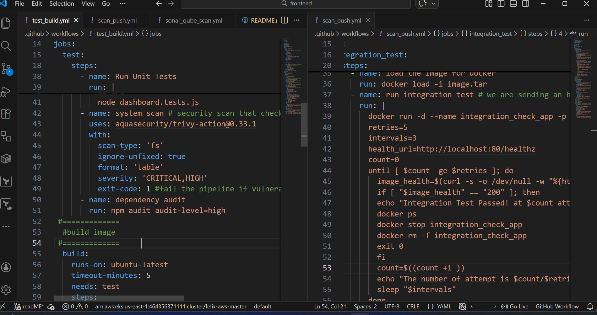
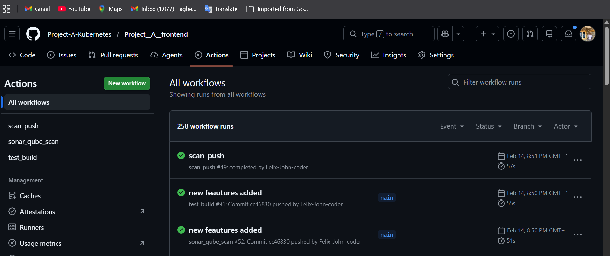
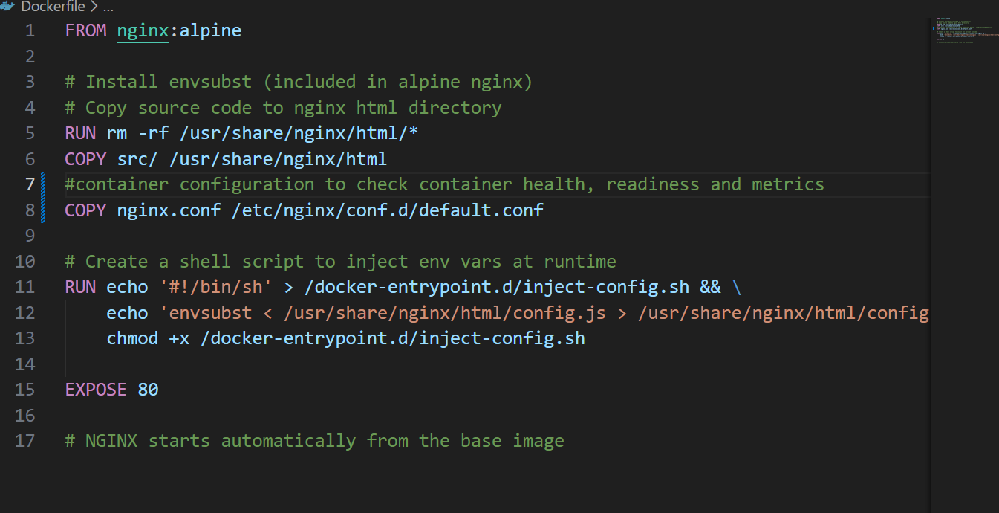

*Project A - Kubernetes Frontend*

## Project Overview

This project is a frontend service providing <brief purpose/functionality>.
The service is fully containerized with Docker, automated through a CI/CD pipeline, and is designed for deployment on Kubernetes, ensuring scalability, resilience, and maintainability.

## Architecture

    [Git Repository] 
        |
        v
    [CI/CD Pipeline (GitHub Actions)]
        |
        v
    [Docker Test, Build, Scan,  Push to Registry and deploy to cluster]
        |
        v
    [Kubernetes Cluster Argocd(Staging or Production)]
        |
        v
    [Monitoring & Logging (Prometheus / Grafana / ELK)]
## Key Points:

    - Multi-environment deployment (dev, staging, prod)
    - Automated build, test, scan, and deployment
    - Container orchestration with Kubernetes

## CI/CD Pipeline

The CI/CD pipeline ensures automated testing, sonar-qube scaning,  container building, integration scan, push and deployment with gitops.
Pipeline Steps:

- Checkout code from Git repository
- Run linting and unit tests
- Build Docker image
- scan 
- Push Docker image to registry
- Deploy to staging or prod environment
- On approval, deploy to environment

### Example GitHub Actions Workflow:
    
### picture of a successful CICD 
    
## Containerization

### Dockerfile Highlights:

-   Multi-stage build for small image size
-   Exposes port 80
-   Supports environment variables for configuration
-   Health checks for container readiness 

### Example Dockerfile snippet:
    

## Configuration & Secrets
    
-   Environment variables used for database URL and service credentials
-   Secrets stored securely in <AWS Secrets Manager / Kubernetes Secrets>
-   Configs differ per environment:
-       dev.env → local development
-       staging.env → staging cluster
-       prod.env → production cluster

## Kubernetes Deployment

#### Next steps for production deployment on Kubernetes:

-   Define deployment and service manifests (k8s/deployment.yaml, k8s/service.yaml)
-   Use ConfigMaps and Secrets for environment-specific configurations
-   Setup auto-scaling and rolling updates for zero downtime
-   Monitoring with Prometheus/Grafana 

## Monitoring & Logging

-   Monitoring: Prometheus metrics for container health, CPU, memory, and request  rates
-   Alerts configured for errors rate, success rate, high latency, or failed deployments (SLI, SLO, Error Budget, Burn rate)

##  Running Locally (DevOps Perspective)
    # clone the repo to your local machine
     git clone https://github.com/Project-A-Kubernetes/Project__A__frontend.git 
    # change directory 
    cd Project__A__frontend
    # Build Docker image
    docker build -t frontend:latest .

    # Run container locally
    docker run -p 80:80 --name front frontend:latest

    # Check logs
    docker logs -f front
