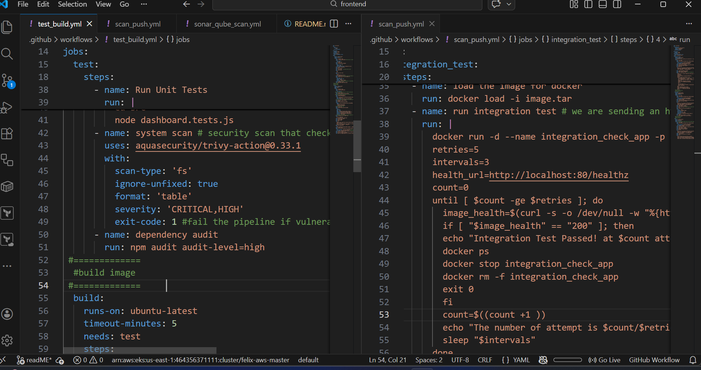
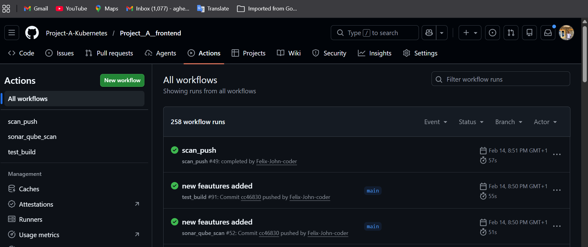
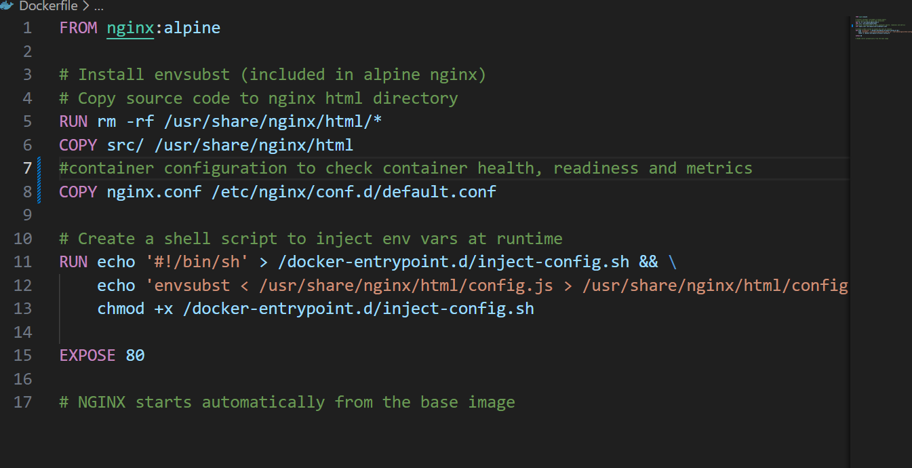

# Project A -  Frontend

## Project Overview

This project is a frontend service providing brief purpose/functionalities This system tracks jobs, add jobs, delete jobs, change job status and display a user friendly dashboard.
The service is fully containerized with Docker, automated through a CI/CD pipeline, and is designed for deployment on Kubernetes, ensuring scalability, resilience, and maintainability with best security practices.

## Architecture

    [Git Repository(Push)] 
        |
        v
    [CI/CD Pipeline (GitHub Actions)]
        |
        v
    [Docker Test, Build, Scan,  Push to Registry and Update Helm Chart]
        |
        v
    [Kubernetes Cluster Argocd Deploy on(Staging or Production)]
        |
        v
    [Monitoring & Logging (Prometheus / Grafana / ELK)]
## Key Points:

    - Multi-environment deployment (dev, staging, prod)
    - Automated build, test, scan, and deployment
    - Container orchestration with Kubernetes


## CI/CD Pipeline

The CI/CD pipeline ensures secure automated testing, source code scanning with sonar-qube scaning, unit tests and linting, dependencies scan  container building, integration scan, push and deployment with Gitops.

### Pipeline Steps:

- Checkout code from Git repository
- Run linting and dependencies scan
- Run unit tests 
- trivy security FS scan
- sonar-qube code quality scan
- Build Docker image
- integration scan  
- trivy image security scan
- Push Docker image to private ECR (On approval)
- Update Frontend Helm Chart ( On approval, deploy to environment)
- Deploy to staging or prod cluster using Gitop practice (Argocd)


### Example GitHub Actions Workflow:

### picture of a successful CICD 



## Containerization

### Dockerfile Highlights:

-   Multi-stage build for small image size
-   Exposes port 80
-   Health checks for container readiness and liveness 

### Example Dockerfile snippet:



## Configuration & Secrets
    
-   Environment variables use for communication to backend 
-   Secrets stored securely in <AWS Secrets Manager / Kubernetes Secrets>
-   configuration injected with kubernetes configmap 
-   workflow secrets are stored in github secrets
-   Configs differ per environment:
-       local development
-       staging cluster
-       production cluster

## Kubernetes Deployment

#### Next steps production deployment on Kubernetes:

-   Define deployment, service and other resources manifests with Helm
-   Use ConfigMaps and Secrets for environment-specific configurations
-   Setup auto-scaling and rolling updates for zero downtime
-   Setup canary deployment
-   Monitoring with Prometheus/Grafana/alertmanager 

> **Note:** Check [`project-a-frontend-helm-chart` ](https://github.com/Project-A-Kubernetes/Project__A_Helm_Chart_Frontend-.git) for the Frontend Helm chart.

##  Running Locally (DevOps Perspective)
```
    # clone the repo to your local machine
     git clone https://github.com/Project-A-Kubernetes/Project__A__frontend.git 

    # change directory 
    cd Project__A__frontend

    # Build Docker image
    docker build -t frontend:latest .

    # Run container locally
    docker run -p 80:80 --name front frontend:latest

    # Check logs
    docker logs -f front
```